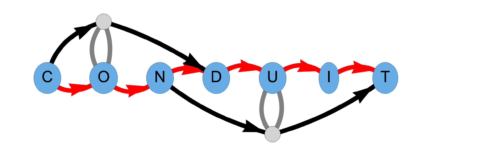

<!---GNU James Taylor--->



# CONDUIT - CONsensus Decomposition Utility In Transcriptome-assembly
#### Builds a transcriptome independent of a reference genome using Oxford Nanopore Technologies and optionally Illumina RNA-seq data (recommended)

### Building CONDUIT:
CONDUIT is built in Nim (A statically typed, compiled systems programming language with python-like syntax).

CONDUIT therefore requires a Nim installation. Easy Nim installation instructions can be found here: https://nim-lang.org/install.html

CONDUIT also uses the following libraries:
*    [poaV2](https://github.com/tanghaibao/bio-pipeline/tree/master/poaV2), the necessary files of which are distributed in the CONDUIT GitHub and need not be downloaded separately.
*    [nim-hts](https://github.com/brentp/hts-nim), which wraps htslib in nim.
*    [htslib](https://github.com/samtools/htslib), a C library for interfacing with common bioinformatics file formats.
*    [threadpools](https://github.com/yglukhov/threadpools), which provides instance threadpools in nim.

And the following tools must be installed:
*   [samtools](https://github.com/samtools/samtools)
*   [bowtie2](https://github.com/BenLangmead/bowtie2)

#### Installing threadpools:
Threadpools is the only library listed above without listed installation instructions, they are therefore provided here.
Once you've installed nim, installing threadpools is quite simple:
```
git clone https://github.com/yglukhov/threadpools
cd threadpools
nimble install -y
```

Once all the required libraries and tools are installed, building CONDUIT can be done in the following manner:
```
git clone https://github.com/NatPRoach/conduit.git
cd conduit
make
```
This should result in a `conduit` binary file which can then be used.

A Conda recipe is coming ASAP, which should ease installation significantly.

### Running CONDUIT - 
CONDUIT requires as input reads clustered at the gene level, with one gene level cluster per FASTA or FASTQ file located in the same directory. For this purpose we reccomend the use of [RATTLE](https://github.com/comprna/RATTLE) gene level clustering, which outperforms minimizer based clustering per the [RATTLE preprint](https://doi.org/10.1101/2020.02.08.939942).

Therefore, if one has a dRNAseq fastq file `nano_reads.fastq`, first install and run RATTLE clustering:
```
path/to/rattle/binary/rattle cluster -i path/to/nano_reads.fastq --rna --fastq -o path/to/gene/clusters/
```
RATTLE clustering outputs a binary file, `clusters.out`, summarizing the clusters extracted. At the moment, CONDUIT requires these clusters to be extracted from the `clusters.out` file RATTLE produces into one FASTQ or FASTA file per gene cluster, all located in the same directory. Because CONDUIT can in theory polish sufficiently accurate single read clusters, `-m` can be set as low as `1`, though higher `-m` values will result in more stringent and accurate final clusters (though `--stringent` mode should overcome this loss in stringency, and so we reccomend running with `-m 1` if running in `hybrid` `--stringent` mode):
```
path/to/rattle/binary/rattle extract_clusters -i path/to/nano_reads.fastq -c path/to/gene/clusters/clusters.out --fastq -m 1 -o path/to/gene/clusters/
```

Once clusters have been extracted by RATTLE, CONDUIT is ready to run. If you only have nanopore data, you can run in `nano` mode, though `hybrid` mode is strongly encouraged as `nano` mode extracted transcripts will still have a reasonably high level of error.

An example CONDUIT command is provided below, for more advanced usage check the `--help` statement or the usage statement below:
```
path/to/conduit/binary/conduit hybrid -o path/to/outdir/ --tmp-dir path/to/tmpdir/ path/to/gene/clusters/ -1 path/to/illumina/mate_1.fastq.gz -2 path/to/illumina/mate_2.fastq.gz
```

#### A note about adapters -
Both RATTLE gene level clustering and CONDUIT consensus extraction work better if reads are trimmed of adapters before use. For cDNA, porechop (https://github.com/rrwick/Porechop) is a good adapter trimming tool (though it is no longer supported). Up to date ont-guppy basecallers have built in adapter trimming and should suffice for this purpose as well, for both cDNA and dRNA reads.

### Usage statement for hybrid (ONT + Illumina) assembly:
```
CONDUIT - CONsensus Decomposition Utility In Transcriptome-assembly:
CONDUIT Version 0.1.0 by Nathan Roach ( nroach2@jhu.edu, https://github.com/NatPRoach/conduit/ )
Usage:
  ./conduit hybrid [options] <clusters_directory> {-1 <m1> -2 <m2> | -U <r> | --interleaved <i> | -b <bam>}
  <clusters_directory>   Directory containing the .fasta/.fa or .fastq/.fq files of reads separated by gene cluster
                         NOTE: .gz support coming for nanopore scaffold data, but is not an option at this time

  Illumina data is aligned with Bowtie2, therefore Illumina data is provided in the same format as Bowtie2, namely:
    <m1>                   Files with #1 mates, paired with files in <m2>
                           Could be gzip'ed (extension: .gz) or bzip2'ed (extension: .bz2).
    <m2>                   Files with #2 mates, paired with files in <m1>
                           Could be gzip'ed (extension: .gz) or bzip2'ed (extension: .bz2).
    <r>                    Files with unpaired reads
                           Could be gzip'ed (extension: .gz) or bzip2'ed (extension: .bz2).
    <i>                    File with interleaved paired-end FASTQ/FASTA reads
                           Could be gzip'ed (extension: .gz) or bzip2'ed (extension: .bz2).
    <bam>                  Files are unaligned BAM sorted by read name.

  <m1>, <m2>, <r> can be comma-separated lists (no whitespace) and can be specified many times.
  E.g. '-U file1.fq,file2.fq -U file3.fq'.

Options (defaults in parentheses):
  Scaffold Type:
    --drna (default)
        Scaffold reads are stranded forward relative to coding strand, and may contain U characters instead of Ts
    --cdna-rev-stranded
        Scaffold reads are stranded reverse complemented relative to coding strand
    --cdna
        Scaffold reads are NOT stranded
    --sfq (default)
        Scaffold reads are in FASTQ format
    --sfa
        Scaffold reads are in FASTA format
  Illumina Type:
    -u, --unstranded
        Illumina reads are unstranded
    -f, --fwd-stranded
        Illumina reads are stranded s.t. the first mate originates from the RNA strand
        Ignored if scaffold reads are not stranded
    -r, --rev-stranded (default)
        Illumina reads are stranded s.t. the first mate is the reverse complement of the RNA strand
        Ignored if scaffold reads are not stranded
    --ifq (default)
        Illumina reads are in FASTQ format; Mutually exclusive with --ifa
    --ifa
        Illumina reads are in FASTA format; Mutually exclusive with --ifq
  Consensus Collapsing:
    -m, --score-matrix <path>
        Provide an alternative scoring matrix to use in partial order alignment
        Example formatting for the score matrix can be found at poaV2/myNUC3.4.4.mat
    -d, --isoform-delta (35)
        Maximum indel size to be 'corrected', beyond this size a new isoform is declared. Must be between 0 and 255
    -e, --ends-delta (35)
        Maximum size at the ends of isoforms to 'correct' before splitting. Must be between 0 and 255
    -i, --max-iterations (5)
        Maximum number of iterations to align to and correct scaffolds. Does not include optional final polshing step
        Note: Providing a value of 0 will not perform any graph based illumina correction
    -w, --illumina-weight (10)
        Weight of illumina reads relative to nanopore reads when generating consensus
    --final-polish (default)
        Include a final correction of individual isoforms, not in a splice graph
    --no-final-polish
        Do not do a final correction of individual isoforms, not in a splice graph
  Ouput:
    -o, --output-dir <path> (conduit/)
        <path> where corrected clusters will be written
        NOTE: THIS WILL OVERWRITE EXISTING FILES!
    -n, --no-intermediates (default)
        Does not save FASTA file generated for intermediate rounds of polishing
    -s, --save-intermediates
        Saves the FASTA file generated for intermediate rounds of polishing
  Bowtie2:
    --end-to-end (default)
        Align Illumina reads to ONT scaffolds in end-to-end alignment mode
    --local
        Align Illumina reads to ONT scaffolds in local alignment mode
  Miscellaneous:
    -h, --help
        Display this help message and exit
    -v, --version
        Display the installed version number of CONDUIT and exit
    --tmp-dir <path> (conduit-tmp/)
        <path> where temporary files will be created
    -t, --threads (4)
        Number of threads to run in parallel (used for both Bowtie2 and Partial Order Graph correction)
```