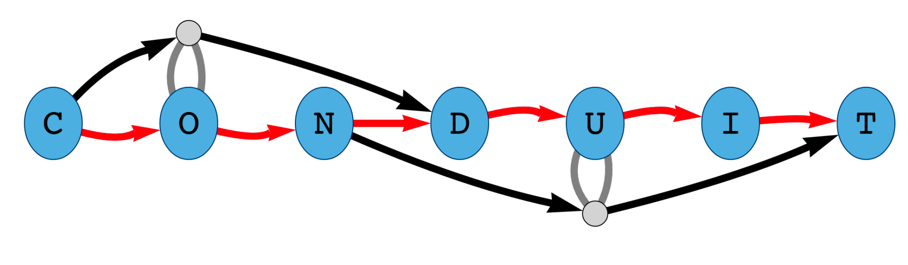

# CONDUIT - CONsensus Decomposition Utility In Transcriptome-assembly
#### builds a transcriptome independent of a reference genome using nanopore and optionally illumina RNA-seq data (recommended)
